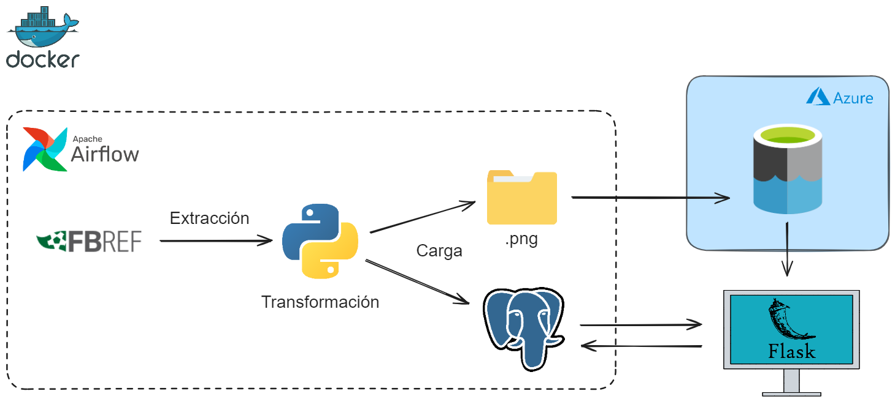

[](LICENSE)

# Partidos Azure App

Bienvenido a mi aplicación de partidos, una plataforma interactiva diseñada para poder seguir en directo los partidos de futbol y sus resultados.

## Tabla de Contenidos
- [Funcionalidades Principales](#funcionalidades-principales)
- [Diagrama del proyecto](#diagrama-del-proyecto)
- [Instrucciones de Uso](#instrucciones-de-uso)
  - [Prerequisitos](#prerequisitos)
  - [Instalación](#instalación)
  - [Tests](#tests)
- [Tecnologías Utilizadas](#tecnologias-utilizadas)
- [Licencia](#licencia)
- [Contacto](#contacto)

## Funcionalidades Principales

- **Obtencion de las ligas:** Permite obtener las ligas de futbol de manera dinamica.

- **Obtencion de los equipos:** Permite obtener los equipos de las ligas de futbol de manera dinamica junto con sus escudos y almacenarlos en una cuenta de almacenamiento.

- **Obtencion de los partidos:** Permite obtener los partidos de futbol de manera dinamica y actualizada con sus resultados.

- **Visualizar los partidos:** Permite navegar a traves de los dias para visualizar los diferentes partidos disputados.

- **Detalle de los partidos:** Permite obtener el detalle de los partidos que se han disputado con informacion relevante.


## Diagrama del proyecto



## Instrucciones de Uso

### Prerequisitos

1. Antes de comenzar, asegúrate de tener instalado Docker en tu máquina. Puedes descargarlo [aquí](https://www.docker.com/get-started).

2. Crea una cuenta o utiliza una existente de Microsoft Azure. Puedes crear la cuenta [aquí](https://azure.microsoft.com/en-us/free/open-source).

3. Una vez creada la cuenta de Azure, deberas crear una cuenta de almacenamiento. Esta cuenta de almacenamiento debe ser un ADLS Gen2 donde se almacenaran los datos de los escudos de los equipos en el Cloud.

4. Agrega las credenciales de la cuenta de almacenamiento para los DAGS en `dags/python/src/datalake/confconexiondatalake.py` 

5. También agrega las credenciales de la cuenta de almacenamiento para la aplicacion web en `web/src/config.py`

### Instalación

Para ejecutar la aplicación con Docker:

1. Clona este repositorio con el siguiente comando:

    ```bash
    git clone https://github.com/nachodorado98/Flask-Partidos-Azure.git
    ```

2. Navega al directorio del proyecto.

3. Ejecuta el siguiente comando para construir y levantar los contenedores:

    ```bash
    docker-compose up -d
    ```

4. Modifica, si crees necesario, los paises y ligas que se van a obtener en el DAG Equipos accediendo a `dags/python/src/config.py`

5. Inicia el DAG Equipos en la interfaz de Apache Airflow para obtener y almacenar los datos de las ligas y los equipos: `http://localhost:8080`.

6. Modifica, si crees necesario, la fecha inicial de los partidos que se van a obtener dentro de la funcion `fechas_etl()` en el DAG Partidos accediendo a `dags/dag_partidos.py`

4. Una vez el DAG Equipos ha finalizado, inicia el DAG Partidos en la interfaz de Apache Airflow para obtener y almacenar los datos de los partidos: `http://localhost:8080`.

### Tests

Para ejecutar los tests de las ETL y la aplicacion:

1. Asegúrate de que los contenedores estén en funcionamiento. Si aún no has iniciado los contenedores, utiliza el siguiente comando:

    ```bash
    docker-compose up -d
    ```

2. Dentro del contenedor del servicio `scheduler`, cambia al directorio de los tests:

    ```bash
    cd dags/python/tests
    ```

3. Ejecuta el siguiente comando para ejecutar los tests utilizando pytest:

    ```bash
    pytest
    ```

Este comando ejecutará todas las pruebas en el directorio `tests` y mostrará los resultados en la consola.

4. Dentro del contenedor del servicio `web`, cambia al directorio de los tests:

    ```bash
    cd tests
    ```

5. Ejecuta el siguiente comando para ejecutar los tests utilizando pytest:

    ```bash
    pytest
    ```

Este comando ejecutará todas las pruebas en el directorio `tests` y mostrará los resultados en la consola.


## Tecnologías Utilizadas

- [](https://www.python.org/)
- [](https://airflow.apache.org/)
- [](https://azure.microsoft.com/en-us/free/open-source)
- [](https://www.postgresql.org/)
- [](https://www.docker.com/)
- [](https://flask.palletsprojects.com/)
- [](https://developer.mozilla.org/en-US/docs/Web/HTML)
- [](https://developer.mozilla.org/en-US/docs/Web/CSS)
- [](https://developer.mozilla.org/en-US/docs/Web/JavaScript)

## Licencia

Este proyecto está bajo la licencia MIT. Para mas informacion ver `LICENSE.txt`.
## 🔗 Contacto
[](https://github.com/nachodorado98/Flask-Partidos-Azure.git)

[](mailto:natxo98@gmail.com)

[](https://www.linkedin.com/in/nacho-dorado-ruiz-339209237/)
